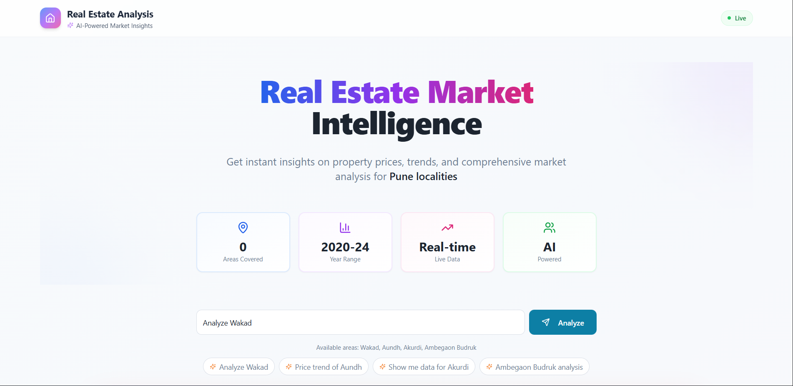
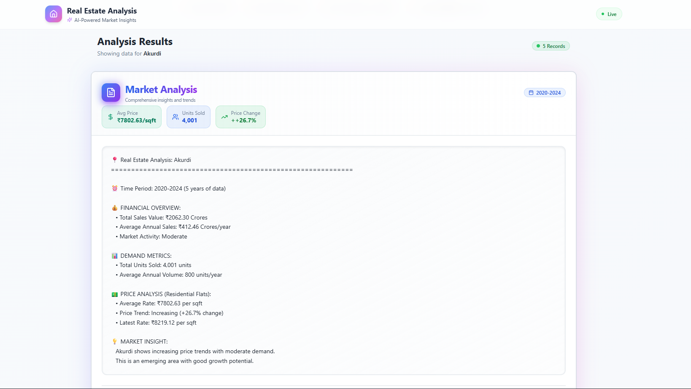
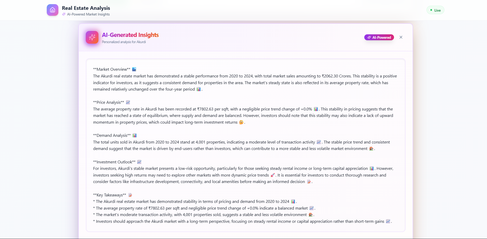
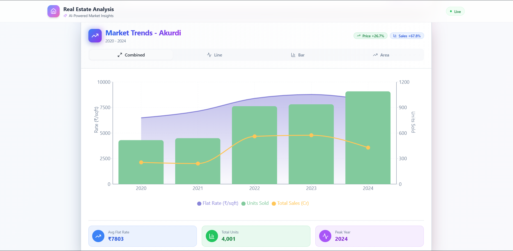
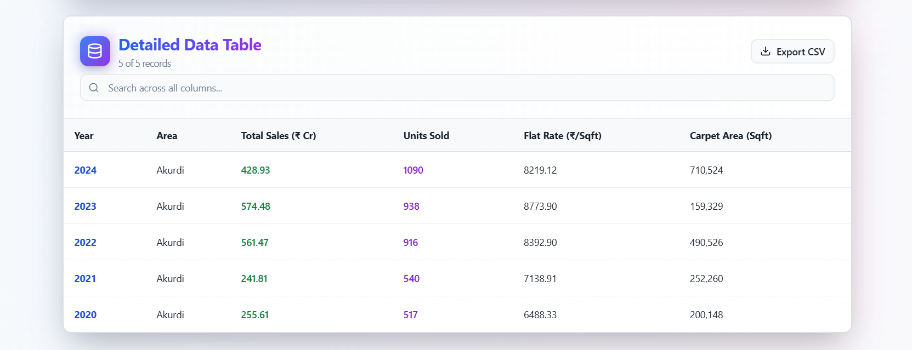

# 🏘️ Real Estate Market Intelligence Platform

An AI-powered web application that provides comprehensive real estate market analysis for Pune localities. Built with React, TypeScript, Django, and powered by Groq AI for intelligent insights.

## ✨ Features

### 🎯 Core Features
- **AI-Powered Analysis**: Generate intelligent market insights using Groq LLM
- **Interactive Visualizations**: Multiple chart types (Line, Bar, Area, Composed)
- **Real-time Data**: Live market data from 2020-2024
- **Advanced Search**: Filter and search across all data points
- **Data Export**: Download analysis results as CSV
- **Responsive Design**: Beautiful UI that works on all devices

### 📊 Analysis Capabilities
- Property price trends and forecasting
- Market demand analysis
- Year-over-year comparison
- Investment recommendations
- Comprehensive market reports

### 🎨 UI/UX Features
- Modern gradient design with blue → purple → pink theme
- Smooth animations and transitions
- Interactive data tables with sorting and pagination
- Quick area selection buttons
- Dark mode support

## 🚀 Tech Stack

### Frontend
- **React 18** - UI library
- **TypeScript** - Type safety
- **Vite** - Build tool
- **TailwindCSS** - Styling
- **Shadcn/ui** - UI components
- **Recharts** - Data visualization
- **TanStack Query** - Data fetching

### Backend
- **Django 4** - Web framework
- **Django REST Framework** - API
- **Pandas** - Data processing
- **openpyxl** - Excel file handling
- **Groq API** - AI-powered summaries

### AI & Analytics
- **Groq LLM** - Natural language generation
- **LLaMA 3.3 70B** - Language model

## 🛠️ Installation & Setup

### Prerequisites
- **Node.js** 18+ and npm
- **Python** 3.11+
- **Git**

### 1️⃣ Clone Repository

git clone [https://github.com/riteshsolke2004/REAL_ESTATE_APP.git](https://github.com/riteshsolke2004/REAL_ESTATE_APP.git)
cd real-estate-analysis

### 2️⃣ Backend Setup

Navigate to backend
cd backend

Create virtual environment
python -m venv estate
estate\Scripts\activate # Windows

source estate/bin/activate # Mac/Linux
Install dependencies
pip install -r requirements.txt

Create .env file
echo "SECRET_KEY=your-secret-key-here
DEBUG=True
GROQ_API_KEY=your-groq-api-key-here" > .env

Run migrations
python manage.py migrate

Start server
python manage.py runserver

Backend will run on `http://localhost:8000`

### 3️⃣ Frontend Setup

Navigate to frontend (new terminal)
cd estate-insight

Install dependencies
npm install

Start development server
npm run dev

Frontend will run on `http://localhost:8080`

## 🎨 Application Preview

### 🏠 Home Page

*Modern landing page with AI-powered market intelligence*

---

### 📊 Analysis Dashboard

*Comprehensive analysis with real-time data visualization*

---

### 🤖 AI-Generated Insights

*Personalized AI summaries powered by Groq LLM*

### 📈 Interactive Charts

*Multiple chart types with smooth animations*

---

### 📈 Interactive Table

*Interactive tables for better understanding*

## 🔑 Environment Variables

### Backend `.env`
SECRET_KEY=django-insecure-your-secret-key-here
DEBUG=True
GROQ_API_KEY=gsk_your_groq_api_key_here

text

### Get Groq API Key
1. Visit [console.groq.com](https://console.groq.com)
2. Sign up / Log in
3. Go to API Keys
4. Create new API key
5. Copy and paste in `.env`

## 📊 Data Format

Place Excel file in `backend/data/realestate_data.xlsx`:

| Column Name | Type | Description |
|-------------|------|-------------|
| final location | string | Area name |
| year | number | Year (2020-2024) |
| total_sales - igr | number | Total sales in ₹ |
| total sold - igr | number | Units sold |
| flat - weighted average rate | number | Avg price per sqft |
| office - weighted average rate | number | Office rate (optional) |
| shop - weighted average rate | number | Shop rate (optional) |

## 🎯 Usage

### 1. Basic Analysis
Query: "Analyze Wakad"

text

### 2. Price Trends
Query: "Price trend of Aundh"

text

### 3. Specific Data
Query: "Show me data for Akurdi"

text

### 4. AI Summary
Click **"Generate Personalized AI Summary"** button after analysis

## 🌐 API Endpoints

| Method | Endpoint | Description |
|--------|----------|-------------|
| POST | `/api/analyze/` | Analyze area query |
| GET | `/api/areas/` | Get available areas |
| POST | `/api/compare/` | Compare multiple areas |
| POST | `/api/download/` | Download CSV |
| POST | `/api/generate-summary/` | Generate AI summary |
| GET | `/api/health/` | Health check |
